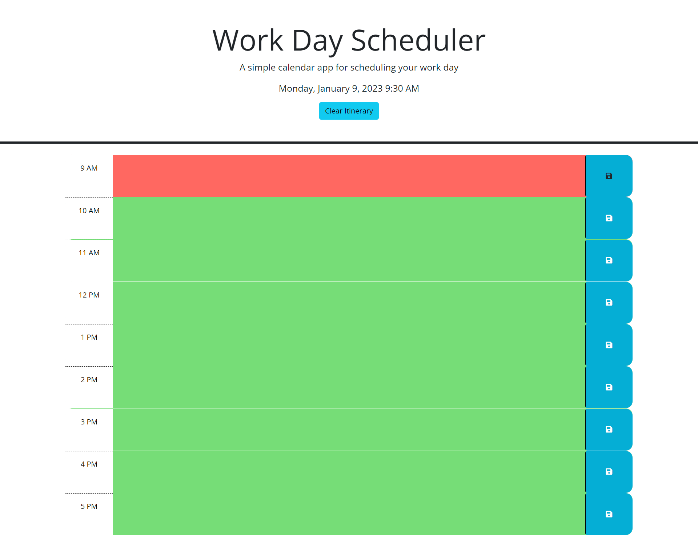

# happy-workaway-aday

## Description

This is a Work Day Scheduler that utilizes JQuery, Bootstrap and Days.js to allow a user to input and save items into an itinerary.

## Current Bugs
*The clear itinerary button works in Live Server but not in deployed webpage.

## Installation
The website is accessible at the links below. You can navigate there with any functional web browser. The website should apper as in the image below:

## Usage
Navigate to the webpage. Fill in the columns with itinerary items and todos, then press the save button to make your input persist.

## Links
*https://github.com/neffej/happy-workaway-aday

*https://neffej.github.io/fuzzy-pw-system/

### References
